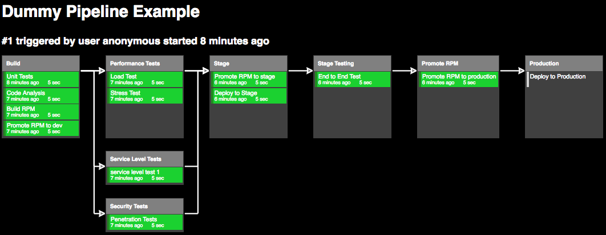
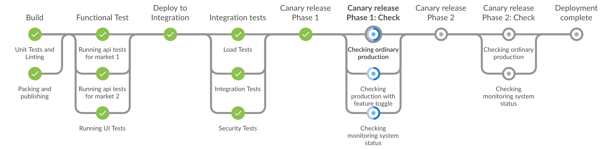

CDeasy - Continuous Delivery made easy
========================================

   
                       ##        .
                 ## ## ##       ==            Example of how Docker and automation can help you
              ## ## ## ##      ===            to improve your continuous delivery process.
          /""""""""""""""""\___/ ===
     ~~~ {~~ ~~~~ ~~~ ~~~~ ~~ ~ /  ===- ~~~   This is not a production ready framework or template
          \______ o          __/              to start using in your current project. Please take
            \    \        __/                 this as an inspiration to improve or implement a
             \____\______/                    Continuous Delivery pipeline for your own needs :)
                             <3 Docker <3
   

About CDeasy
-----------------
 
Here you will find a set of groovy scripts that use job-dsl plugin for jenkins (https://jenkinsci.github.io/job-dsl-plugin), jenkins itself (https://github.com/jenkinsci/jenkins), groovy and spock for testing (https://github.com/spockframework/spock)

By running this example you will be able to setup a jenkins instance with an example of continuous delivey pipeline in your local computer, all instanciated by one simple click ;)

The pipeline you will see is:

You will also see the following example of the new blueocean pipeline:

   
Setting up the environment
===========================

Before clonning this repository you you need docker, docker-compose (1.6.0+) and git in your machine. 
If you want to try new stuff, than a IDE of your preference could be needed. In any case, it should be able to be edited using only VIM (like I do) or any other favority text editor

OSX
----
 
If you are new to docker and you want to get some abstraction on the docker machine, please install boot2docker:

    - https://docs.docker.com/installation/mac/

You will also need to install docker-compose:

    - curl -L https://github.com/docker/compose/releases/download/1.7.0/docker-compose-`uname -s`-`uname -m` > /usr/local/bin/docker-compose
    - chmod +x /usr/local/bin/docker-compose 

For more info please check: http://docs.docker.com/compose/install/

Linux
------
Please check the best way to install in your distribution on http://docs.docker.com/installation/ubuntulinux/

You will also need to install docker-compose:

    - curl -L https://github.com/docker/compose/releases/download/1.7.0/docker-compose-`uname -s`-`uname -m` > /usr/local/bin/docker-compose
    - chmod +x /usr/local/bin/docker-compose 

For more info please check: http://docs.docker.com/compose/install/ 

Windows
-------
This is the link to install boot2docker on Windows. 

    - https://docs.docker.com/installation/windows/

You will also need to use docker-compose here, but I don't know a simple way to do that :( try googling or check this stackoverflow thread:

    - http://stackoverflow.com/questions/29289785/how-to-install-docker-compose-on-windows

In this repo, in the blog post that will follow it and in the presentations there will not have any other reference to windows environments given my lack of experience with it. 

Please consider using another operating system if you are not able to run the full experience at first, then please adapt it later to windows. 
If you see any improvements that these instructions or scripts could have, please consider to pull request :) Credits will be fully given to you

Installing Jenkins, its plugins and seed job the fun way
-------------------------------------------

Please note that you will need a fast internet connection and you will need to allocate at least 2 GB RAM to your boot2docker machine. More memory, faster results ;)

For it you just need to run the folling commands:

      - git clone https://github.com/camiloribeiro/cdeasy.git
      - cd cdeasy
      - docker-compose build jenkins 
      - docker-compose up

It is all set!

Go to your local docker host port 8080 and past the token to start. Since we have installed all the plugins needed to run our pipelines, there is no need to install it in the first step. Just click in the upper right X to close without installing anything.

Installing Jenkins, its plugins and seed job the fast way
-------------------------------------------

Same preconditions as before.

For it you just need to run the folling commands:

      - git clone https://github.com/camiloribeiro/cdeasy.git
      - cd cdeasy
      - docker run -it -p 8080:8080 -v $PWD/docker/jenkins/seed.groovy:/usr/share/jenkins/ref/init.groovy.d/seed.groovy:ro -v $PWD:/var/jenkins_home/workspace/seed:ro camiloribeiro/cdeasy:latest

It is all set!

Go to your local docker host port 8080 and past the token to start. Since we have installed all the plugins needed to run our pipelines, there is no need to install it in the first step. Just click in the upper right X to close without installing anything.

Beta support to blueocean
-----------------

Now this example has also support to the beta version of blueocean, the new jenkins gui. It is very basic and it is only supported by the example_pieline_jenkins2 job.
Keep in mind you still have to run the seed job before anything else. A variant feature will appear in the top of your jenkins (Try Blue Ocean UI ...), if you click there (or add /blue after the jenkins url) you will engage in blueocean beta experience. Be aware it is an beta release and it is still very young, so don't be too judgmental :) I will keep it up to data, so star or follow the repo to try the new versions.

Why is it so badly tested?
-------------------------------------------

I tryed not to test it as it should be tested to avoid increasing the complexity to people recently exposed to jenkins and job-dsl.
I am thinking in a nice way to show how to test the pipeline in modules without scaring non tdders or making people think that it is overcomplicated.

The two pipelines
-------------------------------------------

After setting up the environment like shown before, you will run the seed job, just like any other job. 
Please note that you can change the files as you please and rerun the seed job to see the effects, since all the files are shareded from your local to a docker container.

The first pipeline will show up when executing the "unit_test" job and looking into the "Dummy Pipeline Example" view. This is the legacy pipeline (and still more flexible than the new one).
The second pipeline (native for jenkins 2) will be shown when running the job "example_pipeline_jenkins2".

Developing and Helping
-----------------

You can help this repo to get better by adding more tests, adding more language agnostic builds, adding new features, writing better documentation or refactoring the code.

If you change the code, you must run the tests locally and make sure it is all green before pushing a pull request. 

      - ./gradlew check

Remember to replace the repo url to your forked repo in the job example_pipeline_jenkins2 (dsl/pipeline/example_alpha_pipeline.groovy), only needed if you want to fork and tryout your own implementation.

Have fun!!!

LICENSE
=======

Copyright 2015 - 2016 Camilo Ribeiro camilo@camiloribeiro.com

This file is part of CDEASY.

Licensed under the Apache License, Version 2.0 (the "License"); you may not use this file except in compliance with the License. You may obtain a copy of the License at

http://www.apache.org/licenses/LICENSE-2.0

Unless required by applicable law or agreed to in writing, software distributed under the License is distributed on an "AS IS" BASIS, WITHOUT WARRANTIES OR CONDITIONS OF ANY KIND, either express or implied. See the License for the specific language governing permissions and limitations under the License.
